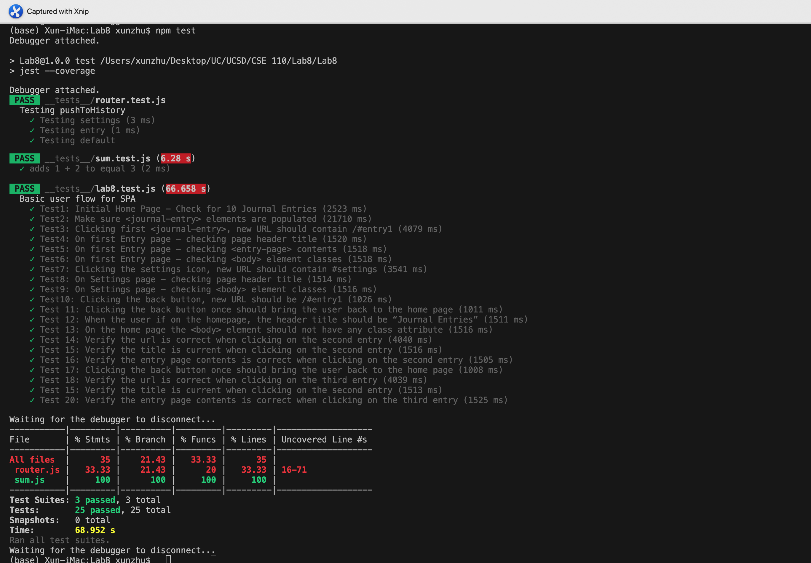

# Lab8_Starter

## Check your understanding q's (FILL OUT)
1. In your own words: Where would you fit your automated tests in your Bujo project development pipeline? (just write the letter) 

Before the push? Run them on the local environment, and I think for our CI/CD pipeline assignment, we build some github actions to set up the different workflows, and want to use them to test our code. 
I think the answer is 1.

2. Would you use a unit test to test the “message” feature of a messaging application? Why or why not? For this question, assume the “message” feature allows a user to write and send a message to another user. 

Maybe not, message don't like code needed to be test it right or wrong. So in the process of people write and send, I think these is no necessary to use the unit test.

3. Would you use a unit test to test the “max message length” feature of a messaging application? Why or why not? For this question, assume the “max message length” feature prevents the user from typing more than 80 characters

In this situation, then it's not like the previous one, there is a limit here, so I think it's necessary for us to test the length of the message, because there is possibility that lots of people don't pay attention to the requirement. 

4. What do you expect to happen if we run our puppeteer tests with the field “headless” set to true?

If we set it to true, then the puppeteer won't run the tests without a browser UI.

5. What would your beforeAll callback look like if you wanted to start from the settings page before every test case?

So we need to clik on the setting button manually.

# Authors
- Xun Zhu

# Screenshot
